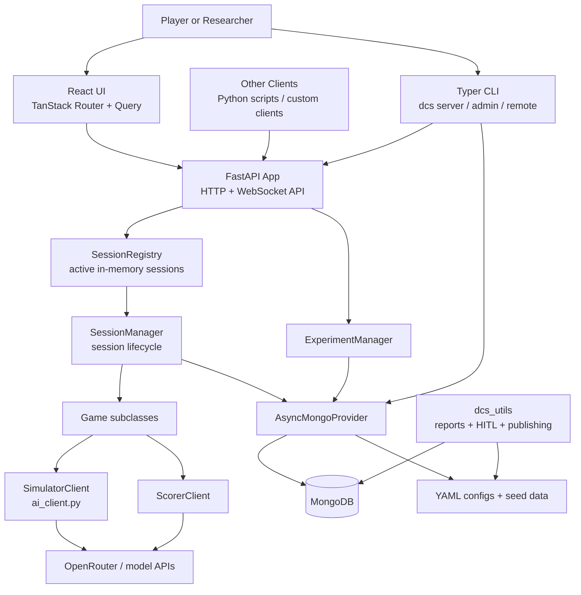
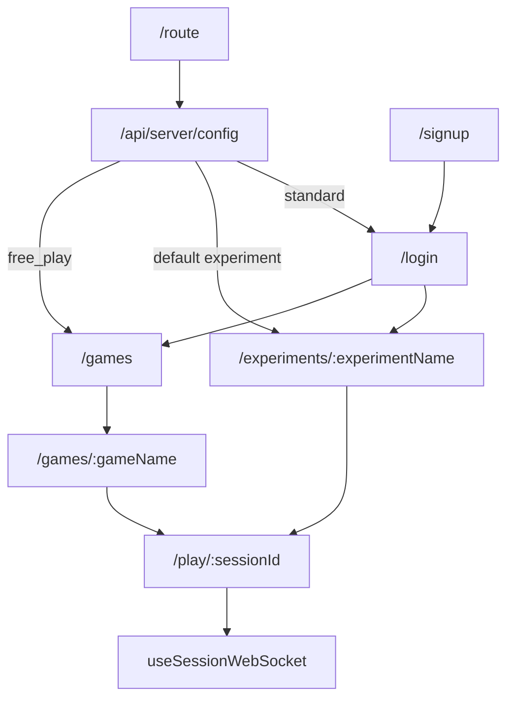
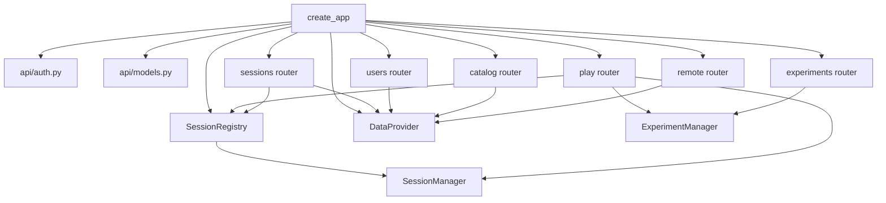
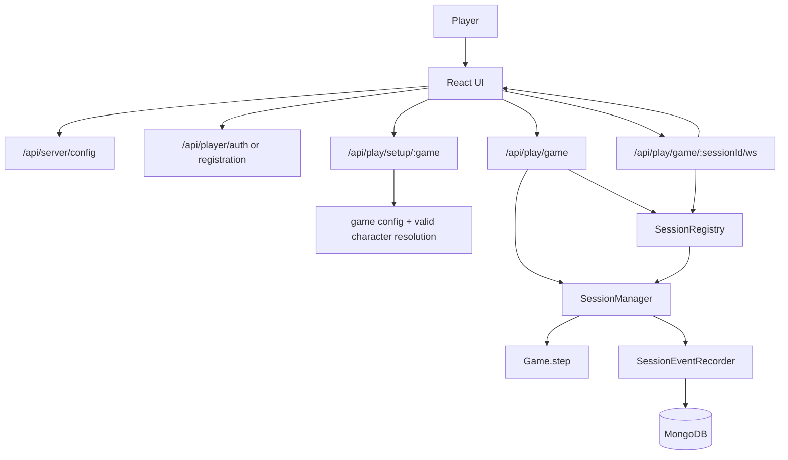
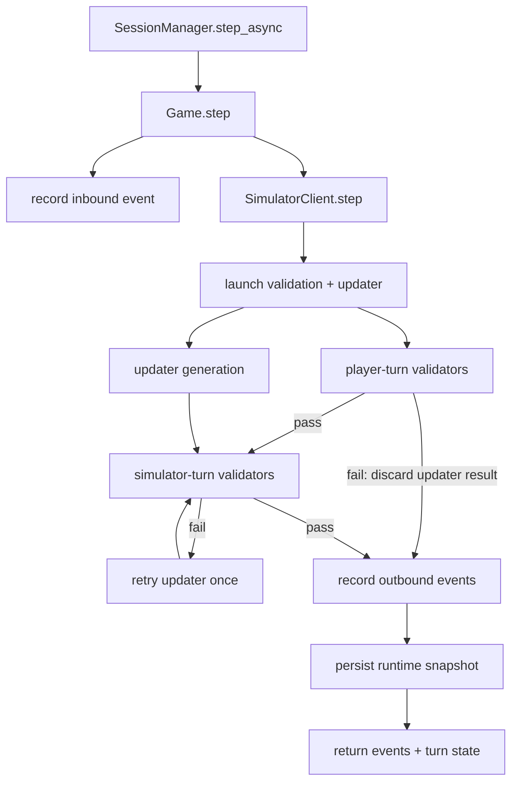
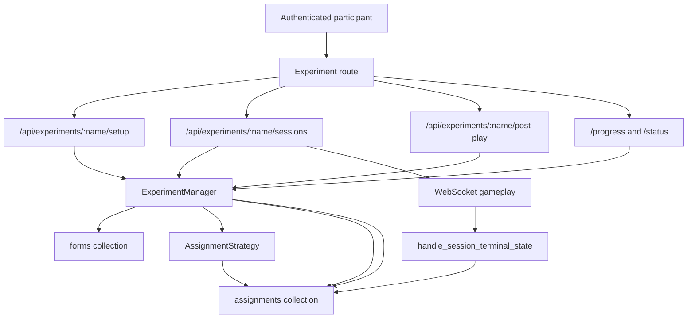
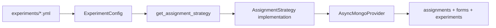
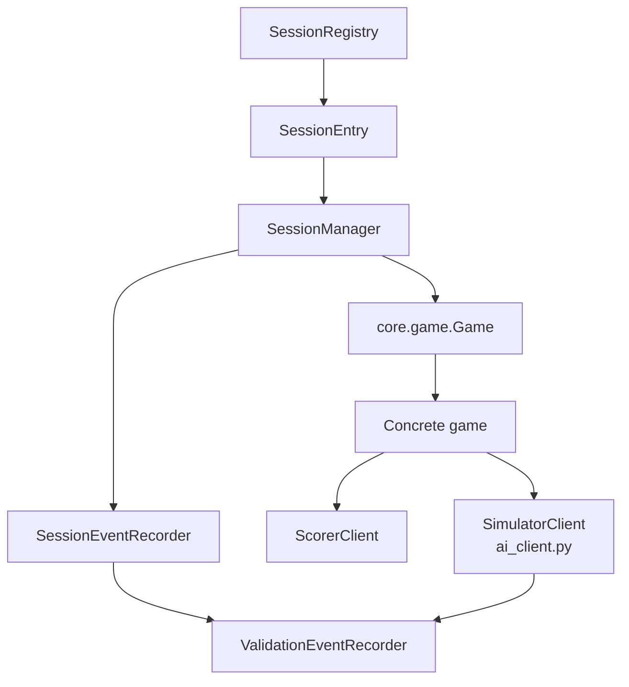
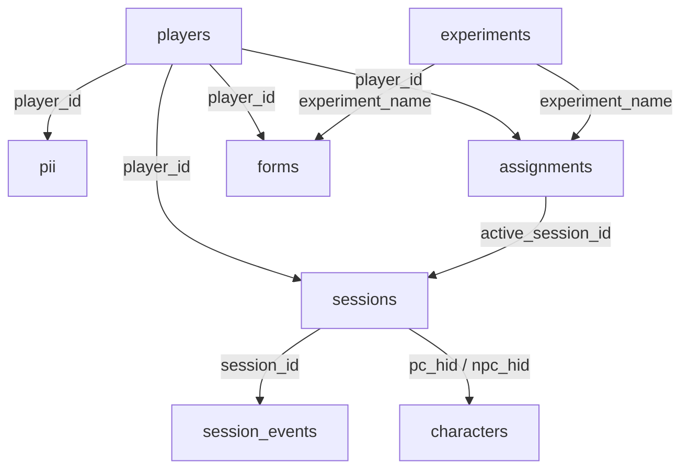
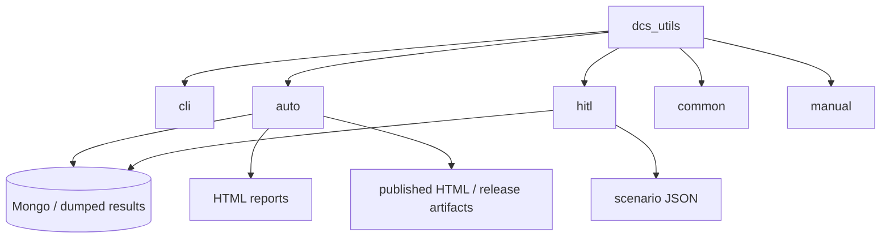

# Architecture Overview

Last updated: 2026-04-27  
Codebase anchor: current `main` workspace state in this repository

This document is an overview of the current DCS Simulation Engine architecture. It is intentionally biased toward what is implemented now, with explicit notes when a design point is more aspirational than fully realized. We do not attempt to cover "what" the DCS engine is at a conceptual level. For that see the [README.md](../README.md) and related team documents.
## Executive Summary

At a high level, the application is a monorepo with:

- A Python backend that ats a FastAPI server
- An optional React UI that behaves as a client of that backend
- A MongoDB-backed persistence layer
- YAML-driven game and experiment configuration
- Offline utilities for reporting, evaluation, and infrastructure deployment

The architectural through-line is:

1. The backend owns business logic, orchestration, validation, persistence, and experiment policy.
2. The frontend is a thin client for the api. It handles registration, setup, live play, and feedback.
3. Session execution is event-oriented and WebSocket-driven.
4. Durable state lives in MongoDB, while active sessions are cached in memory for low-latency interaction.

## Current vs. Intended Design

### Current

- API-first engine: the backend is usable without the bundled UI.
- UI/API separation: gameplay rules and experiment policy are primarily owned by Python backend code.
- Config-driven runtime: YAML files select games and experiments without requiring UI changes.
- Event-oriented session persistence: `sessions` plus ordered `session_events` support replay, feedback, branching, and resume.
- DAL boundary: storage-specific logic is mostly contained inside `dcs_simulation_engine/dal/`, with Mongo as the only full implementation.
- Extensible gameplay surface: games, character filters, assignment strategies, and deployment modes are all extension seams in the current code.

### Intended / Incomplete

- Strict API-as-source-of-truth for all gameplay metadata.
  The backend owns the real rules, but the UI still hardcodes some values and command affordances.
- Fully swappable DAL.
  The `DataProvider` abstraction exists, but the codebase currently depends on the async Mongo provider in practice.
- Thinner transport layer.
  The API routers, especially WebSocket play orchestration, still own more coordination logic than the ideal design would place there.
- More complete architecture/ops documentation.
  Several docs pages and health/status surfaces still contain TODOs or partial coverage.

## Reference Map

This is the quick “where do I open the code?” table the rest of the document refers to.

| Component | File |
|---|---|
| FastAPI app factory | `dcs_simulation_engine/api/app.py` |
| API auth helpers | `dcs_simulation_engine/api/auth.py` |
| API request/response + WS models | `dcs_simulation_engine/api/models.py` |
| Generic play router | `dcs_simulation_engine/api/routers/play.py` |
| Sessions router | `dcs_simulation_engine/api/routers/sessions.py` |
| Experiments router | `dcs_simulation_engine/api/routers/experiments.py` |
| Catalog router | `dcs_simulation_engine/api/routers/catalog.py` |
| Users router | `dcs_simulation_engine/api/routers/users.py` |
| Remote-management router | `dcs_simulation_engine/api/routers/remote.py` |
| In-memory session registry | `dcs_simulation_engine/api/registry.py` |
| Session orchestrator | `dcs_simulation_engine/core/session_manager.py` |
| Experiment orchestrator | `dcs_simulation_engine/core/experiment_manager.py` |
| Base game abstraction | `dcs_simulation_engine/core/game.py` |
| Game config model | `dcs_simulation_engine/core/game_config.py` |
| Experiment config model | `dcs_simulation_engine/core/experiment_config.py` |
| Assignment strategy registry | `dcs_simulation_engine/core/assignment_strategies/__init__.py` |
| DAL contract | `dcs_simulation_engine/dal/base.py` |
| Async Mongo provider | `dcs_simulation_engine/dal/mongo/async_provider.py` |
| Mongo admin / seeding | `dcs_simulation_engine/dal/mongo/admin.py` |
| Session event recorder | `dcs_simulation_engine/core/session_event_recorder.py` |
| LLM/runtime client layer | `dcs_simulation_engine/games/ai_client.py` |
| Game prompt/constants | `dcs_simulation_engine/games/prompts.py`, `dcs_simulation_engine/games/const.py` |
| Game discovery helpers | `dcs_simulation_engine/helpers/game_helpers.py` |
| Experiment discovery helpers | `dcs_simulation_engine/helpers/experiment_helpers.py` |
| CLI root | `dcs_simulation_engine/cli/app.py` |
| CLI server command | `dcs_simulation_engine/cli/commands/server.py` |
| UI route tree (hand-assembled route tree in this repo) | `ui/src/routes/routeTree.ts` |
| UI WebSocket hook | `ui/src/hooks/use-session-websocket.ts` |
| UI HTTP wrapper | `ui/src/api/http.ts` |
| UI experiment page | `ui/src/routes/experiments/$experimentName.tsx` |
| UI play page | `ui/src/routes/play/$sessionId.tsx` |
| Offline analysis/reporting CLI | `dcs_utils/cli/__main__.py` |

## System Overview

## Runtime Modes

The same backend can be launched in several mutually exclusive modes.

| Mode | What it enables | What it excludes or changes |
|---|---|---|
| `standard` | player registration/auth, experiment endpoints, generic play flows | baseline mode; no remote bootstrap/export endpoints unless `remote_managed` is also configured |
| `free_play` | anonymous play, game setup without registration, simpler local/demo deployment | disables registration, player auth, and experiment-driven flows |
| `remote_managed` | hosted bootstrap, remote DB export, public deployment status, optional default experiment hosting | adds operational endpoints and remote-admin behavior on top of the active server mode |

## UI Architecture

The UI is intentionally thin. It mainly interacts with the backend API:

- discovers backend capabilities from `/api/server/config`
- handles auth and form collection (though the actual auth logic lives in the backend)
- starts or resumes sessions
- opens a WebSocket for live play
- renders transcript and feedback state

Key UI code areas:

- `ui/src/routes/`: route-level pages
- `ui/src/hooks/use-session-websocket.ts`: live session protocol handling
- `ui/src/api/generated/`: Orval-generated API hooks and models
- `ui/src/api/http.ts`: auth-aware fetch wrapper
- `ui/src/lib/auth.ts`: sessionStorage auth and experiment state

## API Architecture

The FastAPI app is the true application runtime. It wires:

- app lifecycle
- provider creation
- session registry startup/shutdown
- game and experiment config preloading
- HTTP routers
- WebSocket gameplay

Main backend packages:

- `dcs_simulation_engine/api/`: HTTP and WebSocket transport
- `dcs_simulation_engine/core/`: orchestration, configs, experiments
- `dcs_simulation_engine/games/`: game implementations, prompts, constants, and LLM interaction
- `dcs_simulation_engine/dal/`: storage abstraction and Mongo implementation
- `dcs_simulation_engine/cli/`: process bootstrapping and operational commands

## WebSocket Protocol Overview

The WebSocket protocol is central because the UI is mostly a client of it. The request/response models live in `dcs_simulation_engine/api/models.py`.

### Client -> server frames

- `auth`
  - first-message browser auth frame with `api_key`
  - payload shape: `{ "type": "auth", "api_key": "..." }`
- `advance`
  - submit the player’s next turn text
  - payload shape: `{ "type": "advance", "text": "..." }`
- `status`
  - request current session status
- `close`
  - request explicit session closure

### Server -> client frames

- `session_meta`
  - session id, PC/NPC HIDs, and whether game feedback is enabled
- `replay_start`
  - start of transcript replay when resuming
- `replay_event`
  - one historical message/event during replay
  - payload carries `session_id`, `event_type`, `content`, optional `event_id`, and `role`
- `replay_end`
  - replay finished; includes turn count
- `event`
  - live outbound event during the current turn
  - payload carries `session_id`, `event_type`, `content`, and optional `event_id`
- `turn_end`
  - current turn count plus exited flag
- `status`
  - current session status
- `closed`
  - session was closed
- `error`
  - protocol/auth/runtime error surfaced to the client

## Standard Gameplay Flow

This is the main non-experiment user journey.

Here, “setup” means pre-session setup metadata: load the game config, resolve valid PC/NPC choices for the current player, and tell the UI whether a session can be started. It does use `SessionManager.get_game_config_cached(...)` for config lookup, but it does not create or run a live session manager instance.

### Turn-step internals

This is the narrower `step_async` path from `SessionManager` inward.

Important details:

- Player validation and updater generation are kicked off in parallel for latency reasons.
- The game opening scene is generated lazily on the first `step_async(None)` call.
- Sessions can be paused on disconnect and hydrated back from Mongo if the process restarts.
- Transcript persistence is event-based rather than storing one monolithic chat blob.

## Experiment Flow

Experiment mode adds a policy layer on top of normal gameplay.

The important idea is that experiment participation is not just “play a game.” It is:

1. identify the participant
2. collect before-play forms
3. resolve or assign the next allowed game/PC/NPC triplet
4. run the session
5. collect post-play forms
6. compute progress and status against experiment quotas

`handle_session_terminal_state` lives in `dcs_simulation_engine/core/experiment_manager.py`. It translates a finished gameplay session back into experiment assignment state, for example marking an assignment completed or interrupted depending on how the session ended.

### Assignment strategy architecture

Experiments are extensible through strategy objects registered in `dcs_simulation_engine/core/assignment_strategies/__init__.py`.

This is one of the cleaner extension seams because experiment assignment policy is already centralized in one registry-driven layer, unlike WebSocket session orchestration which is still concentrated inside a transport router.

## Session and Game Runtime Internals

The live runtime is layered on purpose:

- `SessionRegistry` owns active in-memory session entries
- `SessionManager` owns one session’s lifecycle, persistence hooks, and turn counting
- `GameEvent` is the small event record emitted by `Game.step()` and normalized into persisted/session-streamed output
- `Game` subclasses own game-specific rules and finish flows
- `SimulatorClient` owns prompt rendering, validation orchestration, and updater execution
- `ScorerClient` owns post-play scoring calls

### Current game model

Each game combines:

- a Python class in `dcs_simulation_engine/games/*.py`
- a YAML config in repo-root `games/*.yaml`
- shared prompts in `dcs_simulation_engine/games/prompts.py`
- shared game-facing text constants in `dcs_simulation_engine/games/const.py`

That split is deliberate: YAML selects the game, Python executes it, prompts shape model behavior, and `games/const.py` holds the common instruction/help/finish text by convention.

## Persistence and Database Shape

Mongo is the durable system of record. The most important collections are:

- `characters`: playable and simulated character definitions
- `players`: non-PII player metadata and access keys
- `pii`: isolated sensitive fields
- `sessions`: one document per gameplay session
- `session_events`: ordered event log for transcript reconstruction
- `experiments`: persisted experiment metadata and progress snapshots
- `assignments`: experiment assignment lifecycle
- `forms`: before-play participant form responses

The persistence model is hybrid:

- Active session objects live in memory for responsiveness.
- Session transcript and runtime snapshots live in Mongo for durability.
- Resume and replay re-hydrate Mongo state back into in-memory session objects.

## Code Structure

### Directory responsibilities

- `dcs_simulation_engine/api/`
  - FastAPI app factory, routers, auth helpers, WS protocol models
- `dcs_simulation_engine/core/`
  - session orchestration, experiment orchestration, configs, forms, assignment strategies
- `dcs_simulation_engine/games/`
  - concrete game classes, prompts, constants, model client orchestration
- `dcs_simulation_engine/helpers/`
  - discovery and lookup helpers for repo-level game and experiment configs
- `dcs_simulation_engine/dal/`
  - storage abstraction and Mongo implementation
- `dcs_simulation_engine/cli/`
  - operational startup and admin entrypoints
- `ui/`
  - bundled browser client
- `dcs_utils/`
  - offline analysis, coverage reports, HITL scenario workflows, publishing helpers
- `games/` and `experiments/`
  - YAML-defined runtime catalog
- `database_seeds/`
  - bootstrapped character/player/PII seed data

## dcs_utils Architecture

`dcs_utils` is not part of the live request path, but it is part of the application architecture because it owns several research and operations workflows that depend on the same data model.

Main internal slices:

- `dcs_utils/cli/`
  - user-facing `dcs-utils` commands
- `dcs_utils/auto/`
  - automated report generation and HTML publishing helpers
- `dcs_utils/hitl/`
  - human-in-the-loop scenario generation, response collection, and export
- `dcs_utils/common/`
  - shared result-loading helpers
- `dcs_utils/manual/`
  - notebooks and one-off analysis scripts

This area is already cleaner than much of the live UI because it keeps offline workflows out of the request-serving packages, but it is under-documented relative to its importance.

## Extension Points

The application is already designed around a few strong extension seams.

### Strong extension seams

- Game classes are pluggable via `game_class` import paths in YAML.
- Experiment behavior is pluggable via assignment strategy registration.
- Character visibility and eligibility are pluggable via filter registry objects.
- The UI is optional; any client that speaks the API and WS protocol can drive sessions.
- Mongo-specific code is mostly contained inside `dal/mongo/`.
- Reporting and evaluation tooling are already separated into `dcs_utils/`.

### Current practical extension costs

- New games still require both code and YAML, which is good for clarity but creates two sources to keep aligned.
- Swapping the DAL is conceptually supported, but the async Mongo provider is currently the only complete implementation.
- The frontend still hardcodes some game/UI behavior that is not yet exposed by the backend as metadata.

## Current Architecture Trade-offs

The current implementation makes a few deliberate trade-offs:

- It favors Python readability and extension speed over a maximally optimized runtime.
  The consequence is that very high-throughput or low-latency deployments will likely need scaling or targeted optimization instead of relying on raw runtime efficiency.
- It accepts process-local in-memory session caching for responsiveness, then patches durability with snapshots and hydration.
  The consequence is that horizontal scaling is more complex because live session ownership is local to a process unless additional coordination is introduced.
- It keeps the UI optional, which makes the backend API richer but also forces some protocol complexity.
  The consequence is that the WebSocket and HTTP contracts become first-class architecture that must stay stable enough for multiple client types.
- It uses YAML plus Python rather than a purely declarative or purely code-driven model, which improves flexibility but increases alignment overhead.
  The consequence is that config names, file locations, and Python import paths can drift unless validation and conventions stay strong.

## Cleanup and Improvement Priorities

This merges current cleanup observations with recommended next steps.

### High priority

1. Thin out WebSocket play orchestration in `dcs_simulation_engine/api/routers/play.py`.
   Today the router owns auth handling, replay behavior, pause/resume, session finalization, and experiment-assignment sync. That transport layer is doing too much orchestration.

2. Remove duplicated backend knowledge from the UI.
   The biggest examples are UI-local experiment interfaces, hardcoded input limits, and frontend-maintained slash-command metadata. This is the clearest API-as-source-of-truth gap.

3. Split `AsyncMongoProvider` into smaller domain-oriented helpers.
   It currently owns players, sessions, event persistence, branching/resume, experiments, assignments, and forms in one large class.

### Medium priority

4. Reduce duplicated response shaping across routers.
   The experiment and remote routers both rebuild similar progress/status payloads and would benefit from shared mappers or serializers.

5. Make game discovery less stringly typed.
   YAML name lookup plus `importlib` is flexible, but file names, YAML names, and class paths must stay aligned and failures are runtime-only.

6. Break up the frontend experiment route.
   `ui/src/routes/experiments/$experimentName.tsx` currently mixes API calls, assignment flow logic, before-play forms, post-play forms, selection UI, and page layout.

7. Continue tightening docs and status surfaces.
   `docs/codebase_reference.md`, `/healthz`, and several user/design docs are still incomplete or TODO-marked.

### Lower priority

8. Revisit whether a registry-based game loader would improve maintainability enough to justify replacing the current YAML + dotted-path import model.

The remaining work is mostly consolidation rather than reinvention:

- reduce duplicated knowledge
- tighten module boundaries
- turn implicit backend metadata into explicit API contracts
- keep transport code thinner than orchestration code

That puts the codebase in a good position for incremental improvement without a rewrite.
