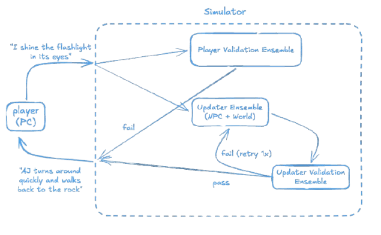

DCS-SE is primarily designed to support our internal use cases. However, because our research is multidisciplinary, those use cases are highly variable. As a result, the system has been built to be inherently extensible and adaptable, and is applicable across a wide range of contexts—including research, training, and integration with external systems.

👉 See the [Codebase Reference](codebase_reference.md) section for codebase-specific design information including major components and data flows.

## Requirements Checklist

DCS-SE is designed to support:

- **A base set of environments + characters** with default configurations that server internal use cases but are extensible
- **Gameplay style extensibility** so the core engine can be integrated with other front ends like VR, audio RPG style interactions, etc.
- **AI research workflows** (training & evaluation) including static and open-ended systems and agents mediating between DCSs (interfacing agents)
- **Psych research workflows** (training & evaluation) with human participants
- **Education and leadership training** use cases that expose neurotypical humans to neurodivergent simulated characters
- **Reproducible results** via re-running w/ fingerprinted configs and deterministic runs

## Simulation Pipeline

DCS-SE uses a structured and modular “ensembles” that coordinate validation and world progression. 

At each step, the **player describes their character's (PC) next action**, which is immediately **broadcast to both a player validation ensemble and an updater ensemble** (parallelized with early exit on validation failure to minimize latency). If **player validation fails, the step exits early** with no state change. If **player validation passes, the updater ensemble proceeds to generate the resulting world update and any non-player character (NPC) responses**, optionally retrying once if generation fails validation. The final output reflects the updated environment and NPC actions, completing a single simulation step.

The validation ensembles are composed of small, atomized validators that vaerify specific engine or game rules are being followed (e.g. if is consistent with the player character’s abilities, observable within the game world). These validators are intentionally lightweight and operate over structured character sheets rather than prose-heavy descriptions, enabling fast, reliable checks for in-character and world-consistent behavior. 

This architecture allows games to customize validation logic while maintaining a consistent, low-latency execution model for role-play-driven simulations.