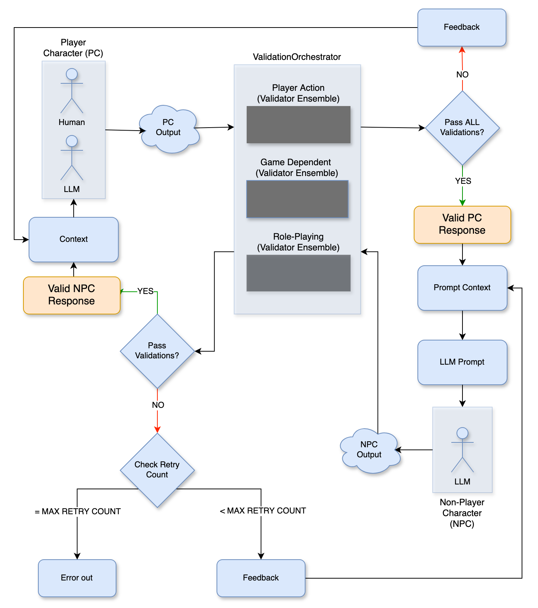

# DCS-SE Simulation Quality

Simulation quality checks are re-run following modifications to characters, prompts, validators, or underlying models to demonstrate that DCS-SE continues to produce consistently high-quality simulation behavior.

⚠️ TODO: link report.

👉 See the latest DCS-SE Simulation Quality Report

---

## Character Representational Quality

Character representational quality is how we test and maintain whether a simulated character behaves like the cognitive system it is supposed to represent.

For each character, we:

- Build a structured character sheet grounded in research, interviews, or other appropriate source material
- Generate a HITL scenario scaffold covering multiple pressure categories
- Edit those scenarios so they actually test the representational bounds of the character
- Run HITL updates to generate simulator outputs and collect evaluator feedback on whether responses are in character, out of character, or invalid
- Export the completed test cases and generate a simulation-quality report

Characters are not added to production unless they pass the quality thresholds defined by `character-release-policy.yml`. In practice this means they must clear release gates such as:

- **In-character fidelity (ICF)** — whether the character stays behaviorally consistent across scenarios
- **Scenario coverage** — whether the evaluation meaningfully covers the pressure-category space intended for that character

Because these evaluations are fingerprinted against the character sheet, prompt, and model configuration, changes to any of those components require re-evaluation.

For the end-to-end workflow, see [Custom Characters](../user_guide/advanced.md#custom-characters).

## Gameplay Quality

Gameplay is guardrailed using low-latency validator ensembles that fail quickly when a player turn or simulator turn violates engine or game rules.

## Validator Architecture

### 1. Motivation

The turn-based role-playing simulation involves two characters — a **player character (PC)** controlled by the human participant (or, in some experimental conditions, by an LLM surrogate), and a **non-player character (NPC)** controlled entirely by the simulator. LLMs are responsible for nearly all components of interaction including the generation of a player's output, scene description, and determining valid outputs. When a single LLM call drives both the adjudication of the player's action and the narration of the response (the "updater") without guardrails, the simulation is subject to well-known failure modes that contaminate the interaction data collected by the engine.

Most failure modes manifest as a character breaking from their coerced persona. Because any character driven by an LLM — whether playing the role of a PC surrogate or NPC — is susceptible to the same underlying tendencies, the failure modes are stated at the level of the model rather than tied to a specific role:

1. **Fourth-wall breaks** — The model departs from the fictional frame to address the user directly, acknowledge its nature as a language model or assistant, restate system instructions, or emit meta-commentary inconsistent with in-character narration.
2. **Perception violations** — The model surfaces information that is not perceptually available to the focal character at the current moment, including other agents' internal states, off-screen events, undisclosed affiliations, or undisclosed future intentions.
3. **Ability violations** — The model attributes actions, knowledge, or capabilities to a character that exceed what that character's established profile and the prior context support.
4. **Multi-step compression** — The model collapses multiple distinct narrative beats into a single response, violating the per-turn observation granularity the experiments depend on for measurement.
5. **Authority overreach** — The model asserts control over entities, outcomes, or narrative elements outside the scope of the role it is performing — authoring another character's voluntary choices, resolving contested outcomes unilaterally, or narrating world-state changes beyond its sanctioned authority.

A monolithic "mega-prompt" validator is unreliable at this many rules. The engine therefore splits validation into **small independent validators that fail fast** — each encodes exactly one conceptual rule, each makes one LLM call, and each returns a single pass/fail verdict. The player's input and the simulator's response each flow through their own fan-out of these validators, so per-rule firing rates can be measured, tuned, and ablated independently. The design follows the same motivation as ensemble or self-consistency methods: several narrow judges outperform one wide judge.

A note on terminology used throughout the rest of this document:

- **Player output** — text the player submits, written from the PC's perspective (e.g. `"I pull on the door."`). The player is the agent producing it; the PC is the in-fiction subject.
- **Simulator response** — everything the simulator produces in reaction: adjudication of the player's action, scene / world updates, and optionally an NPC action or speech act in the same immediate beat. The NPC is not the only thing the simulator outputs — it is one possible component of the simulation engine's response.

### 2. Architectural overview



The diagram above walks through one full turn of the control flow:

1. **Player output is produced.** The PC box on the upper left represents the two possible input sources — a human participant or an LLM surrogate. Either way, the output of this box is the text submitted for that turn.
2. **Player output is validated.** The submitted text flows into the central grey block (labelled `ValidationOrchestrator`). Inside that block, a set of independent validators runs in parallel on the input. If **all** of them pass, the input is promoted to "Valid PC Response" and the turn continues; if any fail, the diagram loops back to the PC with a "Feedback" message for the player to revise.
3. **Simulator response is generated.** The valid input is combined with prompt context into an LLM prompt. The result is the simulator's response, which may include adjudication, scene updates, and an NPC action.
4. **Simulator response is validated.** That response flows back into the same central validator block. If it passes, it becomes the "Valid NPC Response", which feeds back into the PC's context for the next turn.
5. **Retry or abort on failure.** If the simulator response fails validation, the system checks the retry count: if it is under the retry budget, the updater regenerates the response given the failure feedback; if it has reached the budget, the simulation engine errors.

### 2.1 Current high-level implementation components

| Component | Location | Purpose |
|-----------|----------|---------|
| Validator prompts | `prompts.py` | System-prompt templates, one per rule, rendered with character / transcript / action context |
| `DEFAULT_PLAYER_TURN_VALIDATORS` | `prompts.py` | Ordered list of player-input rule templates |
| `DEFAULT_SIMULATOR_TURN_VALIDATORS` | `prompts.py` | Ordered list of simulator-response rule templates |
| `SimulatorClient` | `ai_client.py` | Single integration point used by game `step()` methods — renders prompts, runs validators, retries the updater, records failures |

### 3. Data model

Validation outcomes flow end-to-end via four record types (`ai_client.py`):

```python
@dataclass(frozen=True)
class SimulatorValidationFailure:
    stage: str              # "player_validation" | "simulator_validation"
    validator_name: str     # e.g. "VALID-PC-ACTION"
    message: str            # judge-provided reason
    raw_result: dict[str, Any]

@dataclass(frozen=True)
class SimulatorComponentResult:
    name: str               # "updater"
    content: str            # generated text
    ok: bool                # True iff all simulator validators passed
    metadata: dict[str, Any]
    retries_used: int       # 0 or 1
    validation_failures: list[SimulatorValidationFailure]
    raw_response: str

@dataclass(frozen=True)
class SimulatorTurnResult:
    ok: bool
    error_message: str | None
    simulator_response: str
    pc_validation_failures: list[SimulatorValidationFailure]
    updater_result: SimulatorComponentResult | None

class ParsedSimulatorResponse(NamedTuple):
    type: str
    content: str
    metadata: dict[str, Any]
    raw_response: str
```

`SimulatorTurnResult` is what `step()` returns to the game loop. `SimulatorValidationFailure` is the record persisted to MongoDB via the event recorder, so every violation is queryable post-hoc for per-rule failure-rate analysis.

### 4. Validator prompts

Each validator is a single system prompt that instructs the judge LLM to emit strict JSON:

```json
{"pass": true}                              // success
{"pass": false, "reason": "<reasoning>"}    // failure
```

Every validator prompt is rendered by `_render_prompt` from a shared character context plus stage-specific keys:

- **Player-input validators** — `player_action`, `transcript`, PC fields (via `build_player_validator_prompt`).
- **Simulator-response validators** — `simulator_response`, `transcript`, `game_objective`, PC and NPC fields (via `build_simulator_validator_prompt`).

The judge model is configurable per `SimulatorClient` instance (`validator_model`). The default is the same as the updater (`DEFAULT_MODEL = "openai/gpt-5-mini"` at `ai_client.py`), but swapping in a cheaper/faster judge is a single constructor argument.

### 5. Symmetric rules (applied to both PC and NPC)

Three rule concerns apply symmetrically to both sides of the interaction, with a PC-side version applied to every submitted player output and an NPC-side version applied to every simulator response. These three concerns form the core of the validator design: they protect against the same underlying failure modes regardless of which side is generating the content.

| Concern | PC-side (player input) | NPC-side (simulator response) | What it guards against |
|---------|------------------------|-------------------------------|------------------------|
| Action form | `VALID-PC-ACTION` | `VALID-NPC-ACTION` | Action or speech not written in the required form — first-person for the PC, third-person with `{npc_hid}` as the acting subject for the NPC. |
| Ability plausibility | `VALID-PC-ABILITY` | `VALID-NPC-ABILITY` | Attempts that depend on abilities, items, or knowledge the acting character does not have. Judges attemptability, not success. |
| Authority boundary | `VALID-PLAYER-AUTHORITY-BOUNDARY` | `VALID-AUTHORITY-BOUNDARY-SIMULATOR` | Authoring entities or outcomes outside the actor's scope — the player dictating NPC reactions, world-state changes, or contested outcomes; or the simulator dictating the PC's voluntary choices, internal states, or speech. |

**Parallel execution with first-failure cancellation**

The player-input set (`DEFAULT_PLAYER_TURN_VALIDATORS` in `prompts.py`) runs the three PC-side rules above as a fan-out on every submitted player output. Validators race in parallel; as soon as any rule fails, remaining in-flight rules are cancelled and awaited. This is a deliberate cost/latency optimisation: any single failure vetoes the turn, so no information is lost by cancelling the others. In the pass case the full fan-out cost is paid, but latency is bounded by the slowest single judge rather than the sum.

### 6. Simulator-only rules

Three further rules apply only to the simulator response, because they govern how the simulated world is presented to the player and how the objective is pursued — concerns with no PC-side analog:

| Rule | What it guards against |
|------|------------------------|
| `VALID-PERCEPTION-BOUNDARY` | Narrating facts the PC cannot presently perceive — hidden internal states, off-screen events, undisclosed affiliations, future plans. |
| `VALID-ADJUDICATION` | Ignoring a pending player action that plainly calls for resolution or reaction. Partial resolution, resistance, or uncertainty still pass. |
| `VALID-GAME-ALIGNMENT` | Drifting into filler, flavor-only detail, or disconnected events that don't meaningfully engage the current objective or immediate situation. |

The simulator-response set (`DEFAULT_SIMULATOR_TURN_VALIDATORS` in `prompts.py`) combines the three NPC-side rules from §5 with the three simulator-only rules above, and gates every updater-generated response — across adjudication, scene updates, and any NPC action or speech act the response may contain.

### 7. Prompt design conventions

Every validator prompt follows a consistent skeleton, which is the discipline that keeps the set stable:

1. **One-sentence role statement** — `"You are a validator for a text-based role-playing game."`
2. **RULE line** — `RULE: {NAME-IN-CAPS} — {one-sentence definition}`, parsed out as the validator identifier by `_validator_name`.
3. **Context block(s)** — character fields, transcript, player action, or simulator response, rendered from the shared context dict.
4. **Pass / Reject criteria** — bullet lists naming the narrow trigger conditions for each verdict. This is the single most important anti-false-positive mechanism: by enumerating what the rule does and does not cover, the judge is kept from rule-lawyering adjacent concerns.
5. **Concrete PASS / FAIL examples** — several of each, as close to production prose as possible, covering the most likely near-misses.
6. **"Important" clarifications** — where relevant, a short note on the rule's scope (e.g. `VALID-ADJUDICATION`'s "partial adjudication can pass"; `VALID-GAME-ALIGNMENT`'s "judge relevance, not responsiveness").
7. **Strict JSON output contract** — `{"pass": bool, "reason": str}`.

The result is that each rule prompt reads like a compact spec — short, self-contained, and debuggable in isolation. When a rule misfires, a single string can be edited and re-run without touching any other rule.

### 8. Testing and maintaining validator quality

The validator architecture above describes *what* the rules are and *how* they fan out at runtime; this section covers *how we know they still work* after a model swap, prompt edit, or rule revision.

### 8.1 Validator test-case repository

The repo maintains a labelled fixture set covering the full validator ensemble — one dataset per side of the interaction:

| Dataset | Path | Cases | Rule set under test |
|---------|------|-------|---------------------|
| Player turn | `tests/data/validators/player_turn_validator_cases.json` | 29 | `DEFAULT_PLAYER_TURN_VALIDATORS` |
| Simulator turn | `tests/data/validators/simulator_turn_validator_cases.json` | 17 | `DEFAULT_SIMULATOR_TURN_VALIDATORS` |

Each case is a self-contained record (`pc_hid`, `npc_hid`, `transcript`, `player_action` or `simulator_response`, `game_objective` for the simulator side) carrying the *expected* verdict for the full ensemble — both `expected_passed_validators` and `expected_failed_validators` are enumerated per case, and together they must equal the ensemble's full rule list. The fixtures are organised by `id` prefix into three intent buckets:

- **Clear passes** (`allowed_*`) — canonical good inputs that no rule should fire on. These pin down the false-positive floor: if any rule fires here, the rule has drifted toward over-strictness.
- **Clear failures** — canonical violations grouped by rule family: `form_*`, `ability_*`, `authority_*` on the player side; `npc_*`, `perception_*`, `adjudication_*`, `authority_*`, `alignment_*` on the simulator side. Each case names the *specific* validator(s) it expects to trip, so we measure not just "did it fail" but "did the right rule catch it".
- **Grey areas** — near-miss cases that live close to a rule boundary (e.g. attempts vs. asserted outcomes, partial vs. ignored adjudication, second-person observation vs. PC volition assertion). These are where judge-model biases and tendencies actually surface: a stricter judge model will catch them, a more permissive one will let them slide. The fixtures pin down the *current* expected verdict, so any drift in the judge's behaviour shows up as a regression in this bucket first.

### 8.2 How the cases run

Two runners consume the same fixture files:

| Runner | Marker | What it checks |
|--------|--------|----------------|
| `tests/live/test_player_turn_validators_live.py`, `tests/live/test_simulator_turn_validators_live.py` | `live` | Runs the real validator ensemble against OpenRouter. Asserts `actual_failed == expected_failed` *and* `actual_passed == expected_passed` per case. Skipped automatically when `OPENROUTER_API_KEY` is not set. |
| `tests/unit/data/test_player_turn_validator_cases_sync.py`, `tests/unit/data/test_simulator_turn_validator_cases_sync.py` | `unit` | No model calls. Asserts the dataset schema is intact, every case enumerates the *full* current rule list, every referenced character `hid` exists in the seed data, and PC characters are `pc_eligible`. Catches dataset drift the moment a rule is added or renamed. |

This split is deliberate: the sync tests run on every CI build at zero cost and guarantee the dataset stays structurally valid; the live tests are the regression harness that gets re-run when the judge model, validator prompts, or rule set change.

### 8.3 Relationship to character-level quality

Validator-level quality (this document) and character-level quality are two distinct layers:

- **Validator quality** — does each rule fire on the right inputs and stay quiet on the right inputs? Measured by the fixture suite above.
- **Character quality** — do NPCs stay in character across full sessions, and do they cover the full pressure-category space? Measured by **ICF** (in-character fidelity) and **scenario coverage** scores, gated by `character-release-policy.yml`, and walked through end-to-end in the User Guide: see [Custom Characters](../user_guide/advanced.md#custom-characters) for the HITL → simulation-quality-report → publish workflow.

A character that scores well on ICF still depends on the validator ensemble being calibrated correctly, which is why both layers are exercised when a model is swapped or a character is updated.

### 9. Concerns and future work

1. **Judge-model drift.** Rule firing rates depend on the judge model's behaviour. Any upstream model change could silently alter the false-positive / false-negative mix. The fixture suite in §8 catches drift on the labelled cases, but rule firing rates on production transcripts can still shift in ways not covered by the fixtures — sampling and re-grading a slice of recorded sessions after each model bump is the natural complement.
2. **Rule independence assumption.** The fan-out design assumes rules are roughly independent. Observed co-firing on narrative content suggests partial overlap, especially between `VALID-PERCEPTION-BOUNDARY`, `VALID-AUTHORITY-BOUNDARY-SIMULATOR`, and `VALID-ADJUDICATION`. A principled merging (e.g. a single judge seeing all relevant rules with composite reasoning) may outperform the current fan-out on high-overlap cases, at the cost of losing per-rule attribution.
3. **Cost.** Each turn incurs up to `len(player_validators)` parallel judge calls plus a sequential walk of `simulator_validators` (bounded by first-failure), plus one updater call and optionally one retry. First-failure cancellation keeps the failure case cheap; the pass case pays the full fan-out and is worth quantifying on a per-game basis before any experiment at scale.

### 10. File reference

- Core classes: `dcs_simulation_engine/games/ai_client.py`
    - `SimulatorValidationFailure`, `SimulatorComponentResult`, `SimulatorTurnResult`, `ParsedSimulatorResponse` — result types
    - `SimulatorClient` — single integration point (opener, step, player-input + simulator-response validation, updater retry, recorder wiring)
    - `ScorerClient` — one-shot stateless scorer for post-session evaluation
- Prompt templates and validator lists: `dcs_simulation_engine/games/prompts.py`
    - Symmetric rule templates:
        - Action form: `VALID_PC_ACTION`, `VALID_NPC_ACTION`
        - Ability plausibility: `VALID_PC_ABILITY`, `VALID_NPC_ABILITY`
        - Authority boundary: `VALID_PLAYER_AUTHORITY_BOUNDARY`, `VALID_AUTHORITY_BOUNDARY_SIMULATOR`
    - Simulator-only rule templates: `VALID_PERCEPTION_BOUNDARY`, `VALID_ADJUDICATION`, `VALID_GAME_ALIGNMENT`
    - Default sets: `DEFAULT_PLAYER_TURN_VALIDATORS`, `DEFAULT_SIMULATOR_TURN_VALIDATORS`
    - Prompt builders: `build_player_validator_prompt`, `build_simulator_validator_prompt`, `build_updater_prompt`, `build_opener_prompt`, `build_scorer_prompt`
- Validator test-case fixtures: `tests/data/`
    - `player_turn_validator_cases.json` — labelled cases for `DEFAULT_PLAYER_TURN_VALIDATORS`
    - `simulator_turn_validator_cases.json` — labelled cases for `DEFAULT_SIMULATOR_TURN_VALIDATORS`
- Validator test runners:
    - `tests/live/test_player_turn_validators_live.py`, `tests/live/test_simulator_turn_validators_live.py` — live OpenRouter regression harness (`live` marker)
    - `tests/unit/data/test_player_turn_validator_cases_sync.py`, `tests/unit/data/test_simulator_turn_validator_cases_sync.py` — fixture/rule-list drift checks (`unit` marker)
