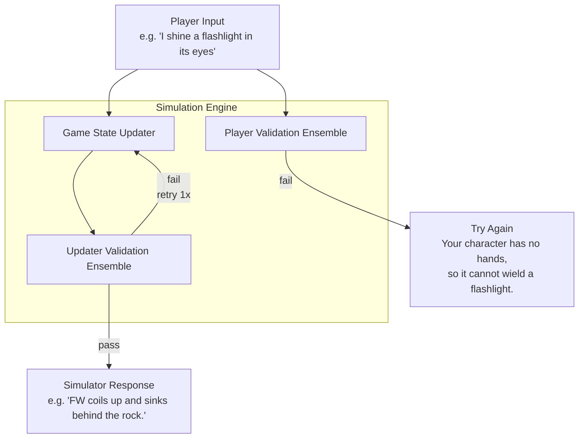

# DCS-SE Simulation Quality

Simulation quality checks are re-run following modifications to characters, prompts, validators, or underlying models to demonstrate that DCS-SE continues to produce consistently high-quality simulation behavior.

⚠️ TODO: link report.

👉 See the latest DCS-SE Simulation Quality Report

---

## Simulation Quality Control Overview

DCS-SE separates simulation quality into two related but distinct areas:

- **Gameplay quality** focuses on constraining the interaction loop between players and the simulator so that actions, world updates, and responses remain valid, coherent, and in character.
- **Character quality** focuses on whether individual characters consistently behave like the cognitive systems they are intended to represent, especially under pressure or adversarial interaction.

These quality domains are evaluated differently. Gameplay quality is tested through runtime validation and guardrailing during live simulation steps, while character quality is evaluated through structured scenario testing, human-in-the-loop review, and longitudinal behavioral analysis.

Importantly, DCS-SE is not designed around the assumption that language or simulation behavior can ever be perfectly constrained. Human communication, roleplay, and cognition are inherently fluid and ambiguous, and that messiness is treated as a feature of the system rather than a failure mode to eliminate entirely.

Instead, DCS-SE uses targeted guardrails, validation ensembles, and evaluation pipelines to:

- Keep simulations behaviorally and structurally on track
- Reduce obvious character breaks and invalid actions
- Surface model limitations, biases, and failure modes clearly
- Make simulation behavior more interpretable for downstream research and analysis

The goal is not perfect simulation fidelity, but controlled and measurable simulation behavior with explicit visibility into where models succeed, fail, drift, or behave unpredictably.

### Gameplay Quality

Gameplay behavior is constrained using low-latency validator ensembles that fail fast when player or simulator actions violate engine or game rules.

DCS-SE uses a modular ensemble architecture to coordinate validation and world progression.

```mermaid
%%{init: {"flowchart": {"curve": "basis"}} }%%
flowchart TD
    PlayerInput["Player Input<br/>e.g. 'I shine a flashlight in its eyes'"]
    SimulatorResponse["Simulator Response<br/>e.g. 'FW coils up and sinks behind the rock.'"]
    RetryRequest["Try Again<br/>Your character has no hands,<br/>so it cannot wield a flashlight."]

    subgraph Simulator["Simulation Engine"]
        direction TB
        PlayerValidation["Player Validation Ensemble"]
        Updater["Game State Updater"]
        UpdaterValidation["Updater Validation Ensemble"]
    end

    PlayerInput --> PlayerValidation
    PlayerInput --> Updater
    PlayerValidation -->|"fail"| RetryRequest
    Updater --> UpdaterValidation
    UpdaterValidation -->|"fail<br/>retry 1x"| Updater
    UpdaterValidation -->|"pass"| SimulatorResponse
```

At each step, the **player describes their character's (PC) next action**, which is immediately **broadcast to both a player validation ensemble and an game state updater(s)** (parallelized with early exit on validation failure to minimize latency). If **player validation fails, the step exits early** with no state change. If **player validation passes, the updater ensemble proceeds to generate the resulting world update and any non-player character (NPC) responses**, optionally retrying once if generation fails validation. The final output reflects the updated environment and NPC actions, completing a single simulation step.

The validation ensembles are composed of small, atomized validators that vaerify specific engine or game rules are being followed (e.g. if is consistent with the player character’s abilities, observable within the game world). These validators are intentionally lightweight and operate over structured character sheets rather than prose-heavy descriptions, enabling fast, reliable checks for in-character and world-consistent behavior. 

This architecture allows games to customize validation logic while maintaining a consistent, low-latency execution model for role-play-driven simulations.

### Character Quality

Character representational quality is how we test and maintain whether a simulated character behaves like the cognitive system it is supposed to represent.

For each character, we:

- Build a structured character sheet grounded in research, interviews, or other appropriate source material
- Generate a HITL scenario scaffold covering multiple pressure categories
- Edit those scenarios so they actually test the representational bounds of the character
- Run HITL updates to generate simulator outputs and collect evaluator feedback on whether responses are in character, out of character, or invalid
- Export the completed test cases and generate a simulation-quality report

Characters are not added to production unless they pass the quality thresholds defined by `character-release-policy.yml`. In practice this means they must clear release gates such as:

- **In-character fidelity (ICF)** — whether the character stays behaviorally consistent across scenarios
- **Scenario coverage** — whether the evaluation meaningfully covers the pressure-category space intended for that character

Because these evaluations are fingerprinted against the character sheet, prompt, and model configuration, changes to any of those components require re-evaluation.

For the end-to-end workflow, see [Custom Characters](../user_guide/advanced.md#custom-characters).