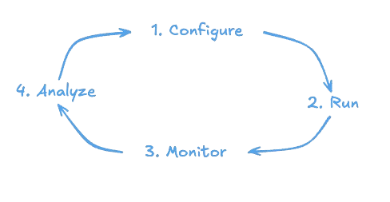

# Getting Started

The general workflow for using the engine across use cases is to configure it (define that game, characters, etc. you want to run), run it (locally or remotely), share access link with players (human or AI), monitor activity, and export gameplay results for analysis. The full user guide contains specific use case examples.

### Key terminology + concepts

| Term | Description |
|---|---|
| **Users** | Run the engine via CLI; configure games, characters, and experiments |
| **Players** | Human or AI participants who play via the web UI or API |
| **Characters** | Cognitive systems that can be assigned as PCs (player characters) or NPCs (non-player characters); vary in goals, sensory/perceptual abilities, etc. |
| **Games** | Python-defined interaction flows (scenarios, objectives, characters) |
| **Run configs** | YAML files that configure a specific engine run (what players, games, characters, etc.) |

## Quickstart

See the [README](https://github.com/diverse-cognitive-systems-group/dcs-simulation-engine?tab=readme-ov-file#how-can-i-use-it) quickstart guide or continue to the full user guide here in the docs.
