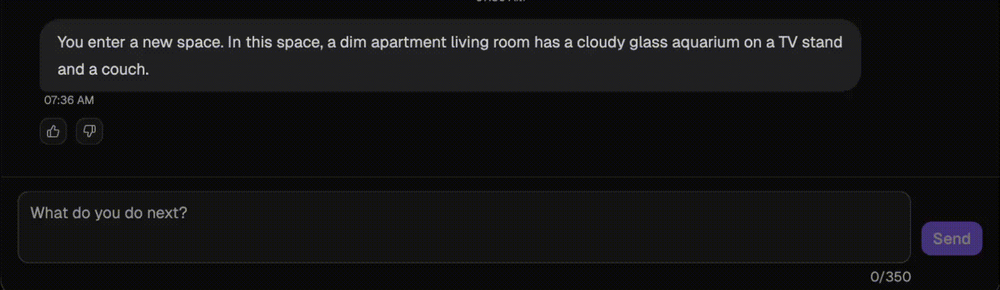

## What it is

The **Diverse Cognitive Systems Simulation Engine (DCS-SE) is an RPG-style gameplay framework for interacting with diverse cognitive systems (DCSs).** This includes neurodivergent humans, AI agents, hybrid systems, and [many other forms of intelligence](faq.md#what-is-diverse-intelligence-di).

## What it enables

The engine supports DCS’s broader research goal of reducing the overhead involved in interacting with forms of intelligence that differ — sometimes radically — from our own.

That includes identifying:

- What a system can perceive and do
- What it cares about
- How it communicates
- What goals may be shared or incompatible with other cognitive systems

## How it works

It works *like an table-top role-playing game (RPG)* environment where AI is the 'dungeon master' and characters are diverse cognitive systems.

- The player controls the player character (PC)
- The system simulates another cognitive system (non-player character, NPC)
- Each turn, the player takes an action and/or the simulator updates the world and generates the NPCs responses.

Each simulated character is driven by a model that produces bounded, in-character behavior based on its sensory constraints, goals, and internal logic.

A configurable game layer defines the structure of interaction:

- Scenarios are implemented as games with varying constraints
- Environments can be open-ended or tightly structured
- Information (e.g., character type) may be hidden, requiring inference through behavior

*In short: you (player) act, the simulation advances the world, and the interaction unfolds—always grounded in the modeled cognition of each system.*

## Why it exists

Interfacing between different cognitive systems—even within the same species or culture—is difficult. Additionally, we lack reliable ways to evaluate how well one system (human, AI, or otherwise) understands the goals, perspectives, and behaviors of fundamentally different minds.

At the same time, new cognitive systems—especially deep learning models—are advancing rapidly without robust methods to assess their ability to engage beyond human-centered assumptions.

DCS-SE addresses this gap by providing a configurable simulation environment where diverse cognitive systems can interact under controlled conditions. These interactions allow us to:

- Evaluate how systems interpret unfamiliar goals and behaviors
- Study coordination, conflict, and alignment across different cognitive styles
- Train systems to engage meaningfully with minds unlike their own

There is also a social motivation: many forms of human neurodivergence are underrepresented in everyday interaction. By modeling [characters inspired by real cognitive diversity](design/characters.md), the system enables users to engage with a wider range of minds than they would typically encounter.

---

_Developed and maintained by the Diverse Cognitive Systems (DCS) group at [Georgia Tech](https://www.gatech.edu/), within the [Sonification Lab](http://sonify.psych.gatech.edu/)._
