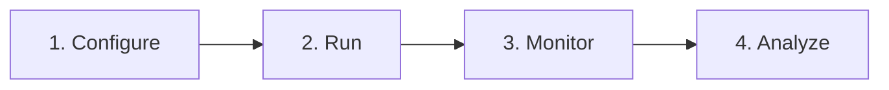

The general workflow for using the engine across use cases is to configure it (define that game, characters, etc. you want to run), run it (locally or remotely), share access link with players (human or AI), monitor activity, and export gameplay results for analysis. The full user guide contains specific use case examples.



Locally (running the engine on your computer), the workflow looks like:

```sh
# Step 1: start the system
dcs engine start --config examples/run_configs/demo.yml

# Step 2: monitor and inspect
dcs engine status

# Optional: mid-run detailed inspection
dcs database dump runs
dcs report results runs/<path_to_dumped_run_results>

# Step 3: stop the system (and clean/remove data volumes)
dcs engine stop --clean

# Step 4: generate a report from dumped run results
dcs report results runs/<path_to_dumped_run_results>
```

Remotely (running the engine on an external server - e.g. so others can play the games), the workflow looks like:

```sh
# Step 1: deploy the system
dcs remote deploy --config examples/run_configs/demo.yml --mongo-seed-path prod

# Step 2: monitor and inspect
dcs remote status --uri <remote_api_url> --admin-key <admin_key>

# Optional: download remote database results without stopping the deployment
dcs remote save --uri <remote_api_url> --admin-key <admin_key> --save-db-path runs/<run_results>.tar.gz

# Step 3: save results and stop the remote deployment
dcs remote stop --uri <remote_api_url> --admin-key <admin_key> --save-db-path runs/<run_results>.tar.gz --api-app <api_app> --ui-app <ui_app> --db-app <db_app>

# Step 4: generate a report from dumped run results
dcs report results runs/<path_to_dumped_run_results>
```
